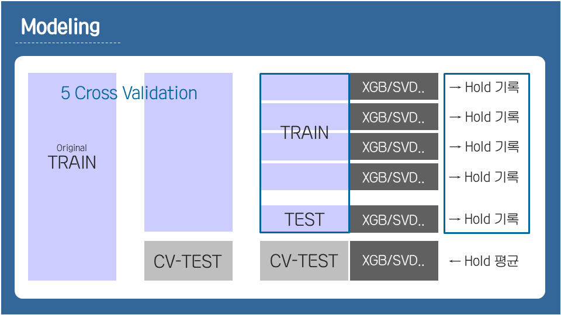
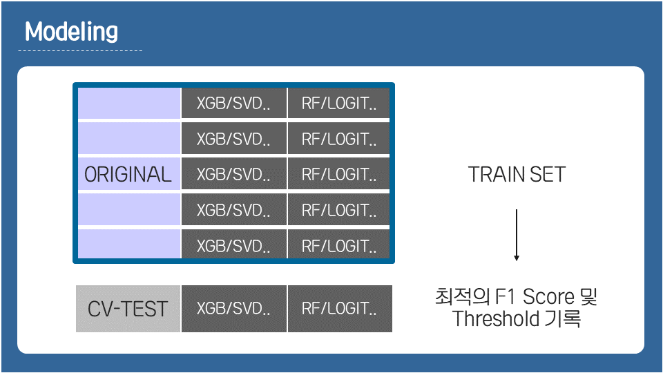

```{r setup, echo = FALSE}
knitr::opts_chunk$set(fig.path = "README_figs/README-")
```

## 1. 프로젝트 목표

대출 고객의 **금융**(신용평가원) + **통신**(SKT) + **보험**(한화생명) 데이터를 이용하여 대출 연체 여부를 예측하는 프로젝트

- 대출 연체 예측 모델 개발
- 가장 높은 F1 Score 기록하기


## 2. 프로젝트 특징

### 1) 비식별화 데이터

독립적인 세 회사의 데이터를 융합하여 제공하는 과정에서, 고객 정보에 대한 **비식별화** 작업이 이루어져, 원래 데이터가 가지고 있던 많은 정보가 손실된 상황이었다. 좋은 모델 성능을 끌어내는데 한계가 있으리라 예상된다.

### 2) 매우 불균형한 타겟 변수

binary 타겟 변수인 '대출 연체 여부(1 또는 0)' 의 불균형이 매우 심했다. 대출 연체를 의미하는 1의 비율이 전체 데이터 중 4%에 불과했다. 이러한 타겟 변수의 불균형은 매우 심각한 모델 성능의 저하를 유발하는데, 예를 들어 모델이 그냥 모든 테스트셋에 대해 0이라고 예측해버려도 Precision이 96%에 육박하게 된다. 또한 테스트셋의 약 2000개 데이터 중 확률적으로 80명 정도가 대출 연체자일 것으로 예상되는데, 이 수가 매우 적기 때문에 F1 Score가 큰 분산을 가질 수 밖에 없다.(한 두명의 예측 성공 실패 여부에 따라 점수가 크게 변한다.) 즉, Target Imbalance로 인해 아래 두 문제를 해결해야 했다.

- Target Imbalance로 인한 모델 성능 저하를 어떻게 막을 것인가?
- 테스트셋에 대해 어떻게 안정적으로 F1 Score를 도출할 것인가?


## 3. 프로젝트 과정

### 1) 데이터 탐색

변수들을 다양하게 시각화하며 데이터를 이해해나갔다. '신용등급이 좋았다가 떨어진 사람이라면 상환 확률이 낮지 않을까?'. '소득대비 많은 돈을 빌린 사람일수록 상황 확률이 낮지 않을까?' 등의 질문을 던지고 가설을 세우며, 데이터를 통해 검증해나갔다. 이러한 정보들은 파생 변수를 생성할 때 유용하게 사용할 수 있었다.

### 2) 피쳐 엔지니어링

지난 공모전에서 좋은 파생변수로 모델의 성능을 대폭 끌어올렸던 경험이 있어, 이번에도 좋은 파생변수를 만들기 위해 많은 시간을 투자했다. 그러나 결과적으로 큰 효과를 거두지는 못했다. 기존 80여개의 변수를 가지고 약 90여개의 파생변수를 만들어봤으나, 크게 모델 성능을 끌어올리는 변수는 없었다. 본선에서 다른 팀들의 발표를 들어봐도, 유의한 파생변수를 발견한 팀은 없었다. 아마 비식별화 등으로 인한 데이터의 질 자체가 낮았기 때문이라고 보여진다.

### 3) 모델링

데이터 자체가 정보를 많이 가지고 있지 않았기 때문에, 모델링에 집중하여 F1 Score를 끌어올려야 했다. 이 때 가장 신경써야 할 포인트가 위에서 언급한 Target Imbalance의 문제였다. 먼저 모델로서는 유명한 앙상블 기법인 Stacking을 사용했다. 우리 모델의 구조는 다음과 같았다.

```{r, echo = FALSE, out.width = NULL}


```

모델링 과정에서 Target Imbalance를 해결하기 위해 1) Threshold를 조정하거나 2) Over, Under-Sampling, SMOTE와 같은 Resampling 기법들을 시도해보았다. 하지만 오히려 원본 데이터를 그대로 사용하는 것이 가장 좋은 성능을 보였다.

Stacking에선 2계층 모델이 가장 좋은 선능을 보였다. 그러나 우리 모델에는 큰 문제가 있었는데, **실제로 제출해야 하는 Test Set과 우리의 Validation Set의 환경이 매우 다르다는 것**이었다. 모델링 과정에서 5-fold Cross Validation을 수행했는데, 이 때 Validation Set은 약 2만명의 관측치를 가지고 있었다. 그러나 Test Set은 겨우 2000명의 데이터만을 가지고 있었기에 모델링의 결과를 신뢰하기 어려웠다. Validation은 수행할 때에 Test Set과 유사한 Validation 환경을 구축하는 것이 매우 중요하다는 것을 배웠다.

실제로 Test Set과 비슷한 Validation 환경을 만들기 위해 49-Fold Cross Validation을 수행한 결과, F1 Score가 매우 크게 요동치는 것을 확인했고, 이에 대한 대책이 필요했다. 팀원의 아이디어로 Validation과 Test Set의 유사도를 계산하는 Metric을 만들었다. 이 아이디어는 본선 심사에서 좋은 평가를 받았으며, 수상을 하는데에 큰 기여를 한 듯 보인다.


## 4. 프로젝트 결과

- 챌린지리그 한국빅데이터포럼의장상 (3등상)


## 5. 나의 역할

- 시각화를 통한 EDA와 여러 파생변수 생성
- MissForest 알고리즘을 이용한 결측치 처리
- Target Imbalance 해결을 위한 솔루션 실험

