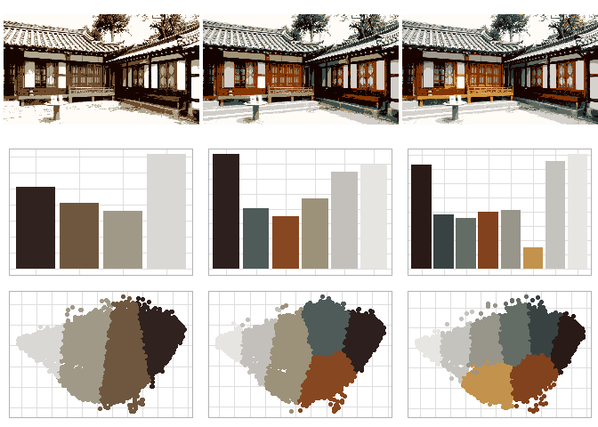

Palette Studio
================

## 1\. 프로젝트 개요

  - 2018년도 YBIGTA 겨울 컨퍼런스를 위해 준비한 프로젝트
  - ’색깔’을 주제로 크게 세 소주제로 구분된 머신러닝 프로젝트
  - 이 중 **Part 3**을 전담하여 R 패키지를 개발

## 2\. 프로젝트 내용

### Part 1. 카카오톡 이모티콘 색상 분석

  - 카카오 이모티콘샵에서 현재까지 나온 모든 이모티콘 이미지를 수집
  - 이모티콘 이미지에서 색상값들을 추출하여 바코드화
  - 출시일 순으로 나열하여 유행에 따라 변화하는 이모티콘 색상 패턴 관찰 가능

### Part 2. 세계 도시를 대표하는 색상 분석

  - 각 도시를 소개하는 동영상을 수집
  - OpenCV를 이용하여 동영상의 프레임들을 이미지화
  - MiniBatch 알고리즘으로 이미지의 대표 색상 추출
  - 대륙별/국가별 대표 색상 패턴을 비교

### **Part 3. img2pal 패키지 개발**

#### 0\) 개요

  - 색상 양자화(color quantization)에 대한 포스팅을 보고 아이디어를 얻음
  - K-means Clustering을 이용하여 이미지의 대표 색상을 뽑은 후 팔레트화
  - 함수들을 R 패키지화하여 Gihub을 이용해 배포
  - Github Rep: <https://github.com/shk5660/img2pal>

#### 1\) K-means를 이용하여 이미지 양자화

  - 이미지 픽셀의 RGB 값들을 K개의 군집으로 Clustering
  - 각 픽셀들을 할당된 군집의 평균 RGB 값으로 변환

#### 2\) K-수준에 따른 시각화 제공

  - K 수준에 따라 어떤 색상이 선택되는지 파악할 수 있는 시각화툴 제공
  - 여러 개의 K 시각화를 살펴본 후 가장 마음에 드는 K 값을 선택

<!-- -->

#### 3\) 선택된 K-값으로 팔레트 생성

  - [Wes Anderson Palette](https://github.com/karthik/wesanderson)를 참고하여
    구현
  - 위에서 고른 K 수준으로 색상 Hex값을 반환하는 팔레트 함수 제공

<!-- -->

## 3\. 프로젝트 결과

  - YBIGTA 컨퍼런스 최우수 프로젝트상

## 4\. 나의 역할

  - Part 3 전담
